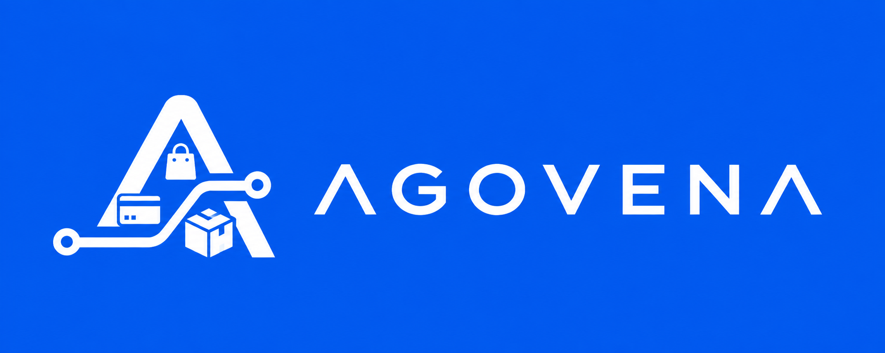

<p align="center">
  
</p>

<p align="center">
  <strong>Open-source commerce, built to stay modular.</strong><br>
  Sell physical products, digital goods, hosting, domains, and subscriptions from one self-hosted platform. Only enable what you need.
</p>

<p align="center">
  <a href="LICENSE"></a>
  <a href="https://github.com/milovd/Agovena/stargazers"></a>
</p>

## Getting started

Agovena is in early development. It is a normal self-hosted Laravel application.

**Native Linux is the primary production path.** Docker is optional convenience, not a runtime requirement.

See **[INSTALL.md](INSTALL.md)** for release-artifact and VPS install steps, and **[SUPPORT.md](SUPPORT.md)** for the honest support matrix.

**Requirements**

- PHP 8.3 or 8.4 with PHP-FPM
- Composer 2
- MariaDB/MySQL for production (SQLite is OK for local/dev; it is not equivalent for concurrency)
- Nginx (recommended) or Apache, document root = `public/`
- A queue worker (`php artisan queue:work`) and cron `* * * * * php artisan schedule:run`
- Node.js 22+ only to **build** frontend assets from a source checkout. Release artifacts should include `public/build`. Merchants should not need npm merely to install a stable release.
- Outbound HTTPS for optional Admin FX sync and automatic EU VAT rates

PHP 8.3 and 8.4 are exercised in CI. MariaDB 11 is exercised in CI for migrations and the test suite. That is not a claim that every host OS is production-verified.

See [deploy/README.md](deploy/README.md) for Nginx/Apache, systemd, cron, permissions, backup, and upgrade.

Redis is recommended for multi-node cache/queue/locks. A single VPS can use `QUEUE_CONNECTION=database` without Redis.

`docker-compose.prod.yml` is an optional stack (nginx, php-fpm, worker, scheduler, MariaDB, Redis). It does **not** auto-migrate.

OS status: see [SUPPORT.md](SUPPORT.md). Do not treat community similarity as validated.

```bash
# Prefer a release tarball (includes vendor + public/build). From source:
composer install
cp .env.example .env
php artisan key:generate
# configure DB in .env, then:
php artisan migrate
# source checkouts only - skip when public/build is already present:
npm install && npm run build
php artisan agovena:install # or open /install
php artisan agovena:doctor
php artisan agovena:verify-providers # all enabled Extensions
php artisan agovena:verify-providers mollie --sandbox # Mollie only; refuses live_ keys
```

`agovena:seed-demo` loads local-only sample products (refuses in production).

- Storefront: `/`
- Login: `/login` (Admin is permission-based at `/admin`)
- Customer account: `/account` (Security / 2FA at `/account/security`)
- Installer: `/install` until the store is installed, then it stays closed

## Stack

- Laravel 13
- Livewire 4
- Blade + Alpine (via Livewire)
- Vite + native CSS (ITCSS/BEM/`--ag-*` and `--theme-*` tokens)
- No Filament / no project-wide Tailwind

## Architecture (two levels)

Merchants choose **selling intents** (physical, digital keys/codes, downloads, subscriptions, hosting/provisioned services, events, or custom). Developers compose those experiences from **Core** + optional **Modules** (capabilities) + **Extensions** (providers) + **Themes** (presentation).

There is no permanent `store_type`. Downloads (files) and Digital Delivery (secrets/keys) are separate Modules. First-party Modules and Extensions ship from the [optional-packages](https://github.com/milovd/optional-packages) monorepo - Extensions use category folders such as `extensions/payments/`, `extensions/provisioning/`, and `extensions/shipping/` (identity comes from each manifest `id`, not the folder path).

See [themes/README.md](themes/README.md), [core/README.md](core/README.md), [CHANGELOG.md](CHANGELOG.md), and [optional-packages](https://github.com/milovd/optional-packages).

## Docs map

| Doc | Purpose |
|-----|---------|
| [INSTALL.md](INSTALL.md) | Install and upgrade |
| [SUPPORT.md](SUPPORT.md) | What is validated vs unverified |
| [CHANGELOG.md](CHANGELOG.md) | Notable product changes toward release |
| [SECURITY.md](SECURITY.md) | Vulnerability reporting |
| [CONTRIBUTING.md](CONTRIBUTING.md) | How to contribute |
| [CODE_OF_CONDUCT.md](CODE_OF_CONDUCT.md) | Community expectations |
| [ATTRIBUTION.md](ATTRIBUTION.md) | Third-party FX / VAT data sources |
| [deploy/README.md](deploy/README.md) | Native hosting templates |

## Security

Please report vulnerabilities privately. See [SECURITY.md](SECURITY.md).

## Contributing

See [CONTRIBUTING.md](CONTRIBUTING.md) and [CODE_OF_CONDUCT.md](CODE_OF_CONDUCT.md).

## License

Licensed under the [MIT License](LICENSE).

Third-party data sources used for optional FX sync and automatic VAT rates are documented in [ATTRIBUTION.md](ATTRIBUTION.md).
