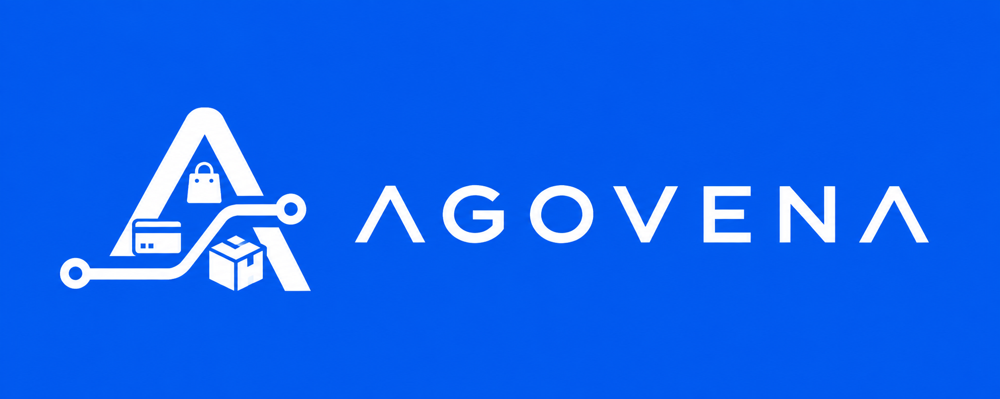

  

  <strong>Open-source commerce, built to stay modular.</strong> 
  Build the store you need on infrastructure you control.

  <a href="https://agovena.com">Website</a> ·
  <a href="https://agovena.com/docs">Documentation</a> ·
  <a href="https://agovena.com/marketplace">Marketplace</a> ·
  <a href="https://agovena.com/development">Developers</a> ·
  <a href="https://discord.gg/W2eJzwsfC6">Community</a>

  
  

## What is Agovena?

Agovena is an open-source, self-hosted commerce platform built with Laravel. It gives you a shared foundation for products, customers, checkout, orders, payments and invoices, with room to add the capabilities your business needs.

Use Agovena for physical products, digital goods, downloads, subscriptions, domains, events, provisioned services, or a combination of them. You do not have to choose one permanent store type.

Agovena is early-stage software. Provider integrations, host environments and deployment paths have different verification levels. Review the documentation and test the flows you need before accepting live orders.

## Built to stay modular

- **Core** provides the shared commerce foundation.
- **Modules** add business capabilities without turning them into permanent store types.
- **Extensions** connect providers for payments, shipping, domains and provisioning.
- **Themes** control storefront and Admin presentation.

First-party Modules and Extensions live in the [optional-packages](https://github.com/milovd/optional-packages) repository. Package identity comes from each `module.json` or `extension.json` manifest.

## Documentation

The [Agovena documentation](https://agovena.com/docs) contains the installation guide, getting started guide, configuration and operations documentation. The [developer documentation](https://agovena.com/development) covers the architecture, API, Modules, Extensions, Themes and contribution workflow.

Browse available first-party packages in the [Marketplace](https://agovena.com/marketplace).

## Contributing

Contributions, focused bug reports and clear documentation improvements are welcome. Read [CONTRIBUTING.md](CONTRIBUTING.md) before opening a pull request and follow the [Code of Conduct](CODE_OF_CONDUCT.md).

Security issues should be reported privately through the [Security Policy](SECURITY.md). Do not include credentials, tokens, secrets or private customer data in issues, pull requests or support requests.

## Community

- [Join the Agovena Discord](https://discord.gg/W2eJzwsfC6)
- [Browse open issues](https://github.com/milovd/Agovena/issues)
- [Visit the Agovena website](https://agovena.com)
- [Explore optional packages](https://github.com/milovd/optional-packages)

## License

Agovena is open source software released under the [MIT License](LICENSE).

Third-party data sources used by optional features are documented in [ATTRIBUTION.md](ATTRIBUTION.md).
